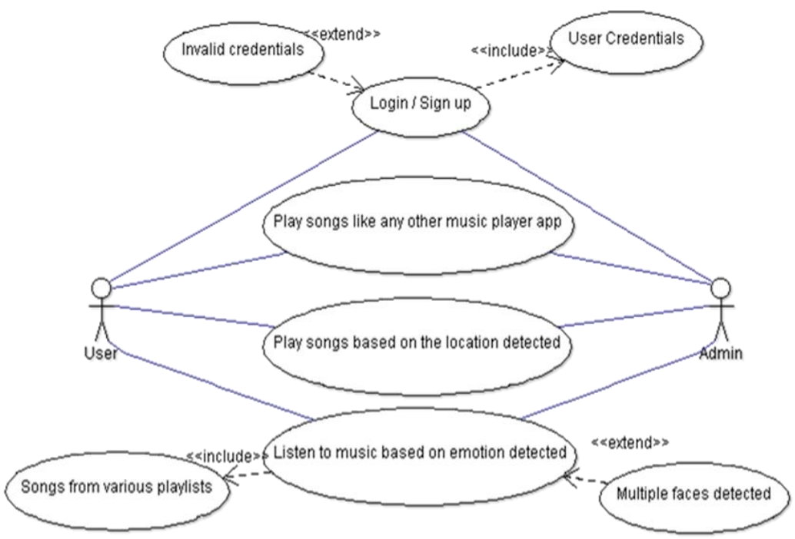
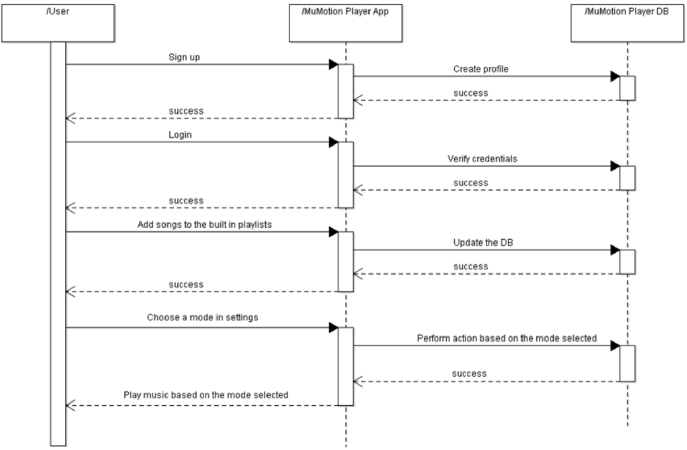
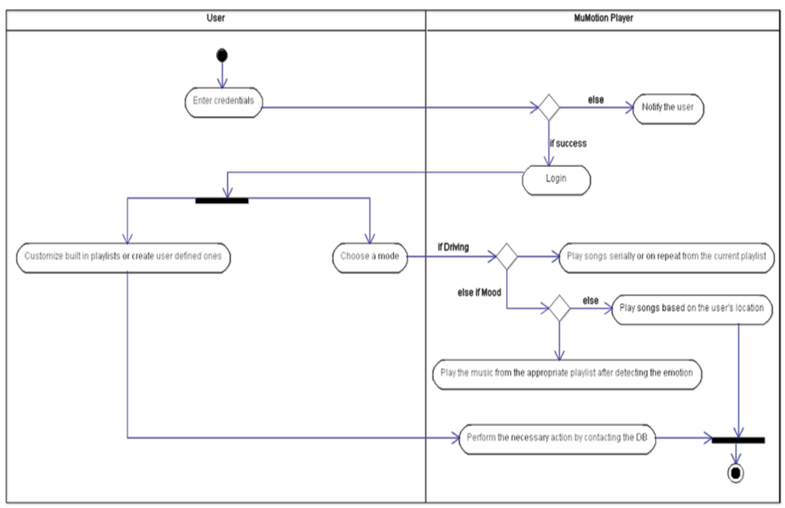

# MuMotion Player

A music player that plays music based on user emotion

# Project Features
- **Facial Emotion Recognition:** Implemented a Convolutional Neural Network (CNN) to detect and classify facial emotions into 7 distinct categories (anger, disgust, fear, happiness, neutral, sadness, surprise) with real-time image capture.
- **Model Performance Benchmarking:** Conducted a comprehensive comparison of 5 machine learning models based on CNN, achieving a peak accuracy of 65.52%, highlighting model strengths and weaknesses.
- **Cloud-Driven Music Playback:** Eliminated the need for local music storage by integrating Spotify SDK, enabling seamless song fetching and playback directly from the cloud.
- **Location-Aware Song Suggestions:** Leveraged Geocoder and Geolocator to recommend and play region-specific popular songs, enhancing user experience through geographically personalized content.
- **Dynamic Playlist Customization:** Built a search-and-add feature that allows users to curate and personalize playlists effortlessly, tailoring the music selection to individual preferences.
- **Voice-Activated Navigation:** Incorporated a voice assistant to enable hands-free navigation, creating a fully contactless user experience and improving accessibility across the app.

# Demo Video

# System Requirements
## Hardware Requirements
- **Processor:** Intel Atom Processor Z2520 1.2 GHz, or faster processor
- **RAM:** 2 GB
- Camera
- GPS

## Software Requirements
**OS:** Android 5.0 or above, iOS 
**Web:** (Chrome/Edge)

## Tools used:
- **IDE:** Android Studio, VS Code
- **SDK:** Flutter, Spotify

## Packages used:

- Tensorflowlite
- Flutter_opencv
- ImagePicker
- Mlkit	
- Geolocator
- Geocoder
- Keras
- Matplotlib
- Tensorflow
- OpenCV
- numpy 
- pandas
- scikit-learn

# Introduction to the domain of work - Deep Learning Model End-to-End

# System Architecture

In the right side of the figure above, the system is trained by preprocessing the image dataset before passing it to the Convolutional Neural Network model(s) to
extract the essential features of the image. The knowledge gained in the training process is fed as input to the classifier which learns to predict for future image
data. In the left side of figure 4.1, the input image is preprocessed to resemble the training dataset before feeding it to the face detection module which then extracts
the essential features from the image and passes it as input to the classifier to perform classification. The tflite convertor is needed to convert the learned model
into a file format which can be run by the tflite interpreter on mobile devices.

# Use-Case Diagram

A use case is a methodology used in system analysis to identify, clarify, and organize system requirements. The use case is made up of a set of possible
sequences of interactions between systems and users in a particular environment and related to a particular goal.

Use case is shown as an ellipse containing the name of use case. An actor is shown as a stick figure with the name below it. Use case diagram is a graph of
actors.

The first module signifies connection with Spotify to login or sign up if the user doesn’t have an account. The login/signup module includes user credentials
and extends invalid credentials where an error must be thrown if credentials are not valid. The use case diagram also specifies three other modules to play music
sequentially, based on location and based on the emotion detected. The emotion detection module includes songs from different emotion playlists and extends
multiple face detection in which case an error is thrown.

# Sequence Diagram

A sequence diagram in Unified Modelling Language (UML) is a kind of interaction diagram that shows how processes operate with one another and in
what order. It is a construct of a Message Sequence Chart. There are two dimensions:
- Vertical dimension represents time and
- Horizontal dimension represents different objects

The user signs up to Spotify and logs in using valid credentials. The user then can customize their emotion playlists and listen to songs based on the mode
selected.

# Activity Diagram

Activity diagram is basically a flowchart to represent the flow from one activity to another. The activity can be described as an operation of the system.
So, the control flow is drawn from one operation to another. This flow can be sequential, branched or concurrent. Activity diagrams deal with all types of flow
by using elements like fork, join etc.

The activity diagram shows the flow of MuMotion Player. The user logs in with their Spotify account if credentials are valid. The user can then choose a
mode in Settings. If the user chooses driving mode, the app plays songs sequentially. If the user chooses location mode, the app detects the user’s location
and plays famous songs available in the area. If the user chooses emotion mode, the app opens the front camera of the mobile device, and plays the first song
available in the emotion detected playlist. The user also has the ability to completely customize their emotions playlist.

# Dataset Description and Preprocessing
The dataset used is fer2013.csv. It consists of 48*48-pixel grayscale images of faces. The faces have been categorised into one of seven categories (0=Angry, 1=Disgust, 2=Fear, 3=Happy, 4=Sad, 5=Surprise, 6=Neutral). Scikit learn’s train_test_split() function is used to split the dataset into training and testing data. 20% is used for testing while 80% is used for training. The training set consists of 28,709 examples. The test set consists of 3589 examples. The dataset consists of three columns - emotions, pixels and purpose. If the pixel values are in the range of (0-255), computational complexity will be high. So, the data in the pixel field is normalized to values between [0-1]. From the graph in figure 5.1, we see that the dataset is imbalanced, with disgust consisting of just 547 images. So, more data is generated using the training set by rotating, cropping, flipping and normalizing the actual training images. An example of horizontal flipping is shown in figure 5.2. Vertical
flipping confuses the CNN and reduces its accuracy and hence it is not used.

# Deep Learning Models Used and Evaluation
## CNN 1

The architecture of the CNN 1 shown above consists of a 2D Convolutional layer followed by Batch Normalization and this set is duplicated
once. The filter size used in 2D Convolution is 16 and the kernel size is (7,7). This is followed by a ReLu activation layer, an average pooling layer and a
dropout layer with the padding set to return the output size equal to the input. This entire set is duplicated three more times before passing the output to the
Convolutional 2D layer with a filter size of 256 and kernel size of (3,3), a batch normalization layer, a Convolutional 2D layer with a filter size equal to the
number of output classes (7 in this case) and a global average pooling layer that extracts the average pixel value of the entire image. This is followed by the
Softmax layer at the output which normalizes the output vector consisting of 7 values for each emotion. The values represent the probabilities of the predicted
labels. The label with the highest probability is the predicted output. The loss and accuracy curves are shown below. 

## CNN 2

The architecture of the CNN 2 shown above consists of a 2D Convolutional layer followed by Batch Normalization and this set is duplicated
once. The filter size used in 2D Convolution is 16 and the kernel size is (5,5). This is followed by a ReLu activation layer and a dropout layer with the padding
set to return the output size equal to the input. This entire set is duplicated three more times before passing the output to the Convolutional 2D layer, batch
normalization and a Convolutional 2D trio which is then duplicated once more. The filter size is 256 and kernel size is (1,1) for the first Convolutional2D layer
for both the duplications. The next Convolutional2D layer has a filter size of 128 and kernel size of (3,3) in the first set and in the duplicated set, it has a filter size equal to the number of output classes (7 in this case) and a kernel size of (3,3). This is followed by the flatten layer which converts the output vector into a 1D
array and the Softmax layer which is used to normalize the output vector consisting of 7 values for each emotion. The values represent the probabilities of
the predicted labels. The label with the highest probability is the predicted output. The loss and accuracy curves are shown below. 

## TX CNN

The architecture of TX CNN shown above onsists of a Convolutional 2D layer with a kernel size of (3,3) and filter size of 5. The stride is set to (1,1). 
L2 regularization is used to generalize the input and avoid overfitting. Bias is set to false. This is followed by a batch normalization layer, a
ReLu activation layer and a Convolutional2D layer with the same parameters as the previous Conv2D layer. The output of this layer, after being normalized in
batches is passed to a ReLu activation layer which then passes the output to be processed parallelly. The first set is processed by a Separable Convolutional 2D,
batch normalization, ReLu activation layer, Separable Convolutional 2D, batch normalization and max pooling layer. Both of the Separable Convolutional 2D
layers have a filter size of 8 and a kernel size of (3,3). L2 regularization is used to generalize the input and avoid overfitting. Bias is set to false. The max pooling
layer divides the image into (3,3) patches and uses a (2,2) stride with padding set to ‘same’. The second set is processed by a Convolutional 2D and batch
normalization. These sets along with the activation layer where the split occurs are duplicated three more times. The kernel size of the Separable Convolutional
2D remains the same for all duplications whereas the filter size changes to 16, 32, and 64 for rounds 2, 3 and 4 respectively. The filter size for the Convolutional 2D
layer for the four rounds is 8, 16, 32 and 64 respectively. The kernel size and stride of the Convolutional 2D for all the four rounds is (1,1) and (2,2) respectively. The output of these four rounds is passed to a Convolutional 2D layer with filter size equal to the number of output classes (7 in this case) and kernel size equal to (3,3). This is followed by a global average pooling layer that extracts the average pixel value of the entire image and a Softmax layer at the
output which normalizes the output vector consisting of 7 values for each emotion. The values represent the probabilities of the predicted labels. The label
with the highest probability is the predicted output. The loss and accuracy curves are shown below. 

## MX CNN

The architecture of MX CNN shown above consists of a Convolutional 2D layer with a kernel size of (3,3) and filter size of 8. The stride
is set to (1,1). L2 regularization is used to generalize the input and avoid overfitting. Bias is set to false. This is followed by a batch normalization layer, a
ReLu activation layer and a Convolutional2D layer with the same parameters as the previous Conv2D layer. The output of this layer, after being normalized in
batches is passed to a ReLu activation layer which then passes the output to be processed parallelly. The first set is processed by a Separable Convolutional 2D,
batch normalization, ReLu activation layer, Separable Convolutional 2D, batch normalization and max pooling layer. Both of the Separable Convolutional 2D
layers have a filter size of 16 and a kernel size of (3,3). L2 regularization is used to generalize the input and avoid overfitting. Bias is set to false. The max pooling layer divides the image into (3,3) patches and uses a (2,2) stride with padding set to ‘same’. The second set is processed by a Convolutional 2D and batch
normalization. These sets along with the activation layer where the split occurs are duplicated three more times. The kernel size of the Separable Convolutional
2D remains the same for all duplications whereas the filter size changes to 32, 64 and 128 for rounds 2, 3 and 4 respectively. The filter size for the Convolutional
2D layer for the four rounds is 16, 32 and 64 and 128 respectively. The kernel size and stride of the Convolutional 2D for all the four rounds is (1,1) and (2,2)
respectively. The output of these four rounds is passed to a Convolutional 2D layer with filter size equal to the number of output classes (7 in this case) and
kernel size equal to (3,3). This is followed by a global average pooling layer that extracts the average pixel value of the entire image and a Softmax layer at the
output which normalizes the output vector consisting of 7 values for each emotion. The values represent the probabilities of the predicted labels. The label
with the highest probability is the predicted output. The loss and accuracy curves are shown below. 

## BX CNN

The architecture of BX CNN shown above consists of a Convolutional 2D layer with a kernel size of (3,3) and filter size of 32. The stride
is set to (2,2). Bias is set to false. This is followed by a batch normalization layer, a ReLu activation layer and a Convolutional2D layer with the same kernel size
as the previous Conv2D layer but with a filter size of 64. The output of this layer, after being normalized in batches is passed to a ReLu activation layer which then
passes the output to be processed parallelly. The first set is processed by a Separable Convolutional 2D, batch normalization, ReLu activation layer,
Separable Convolutional 2D, batch normalization and max pooling layer. Both of the Separable Convolutional 2D layers have a filter size of 128 and a kernel size
of (3,3). Bias is set to false. The max pooling layer divides the image into (3,3) patches and uses a (2,2) stride with padding set to ‘same’. The second set is
processed by a Convolutional 2D and batch normalization. These sets along with the activation layer where the split occurs are duplicated once more. The kernel
size of the Separable Convolutional 2D remains the same for all duplications whereas the filter size changes to 256 for round 2. The filter size for the
Convolutional 2D layer for the two rounds is 128 and 256 respectively. The kernel size and stride of the Convolutional 2D for both the rounds is (1,1) and (2,2)
respectively. The output of these two rounds is passed to a Convolutional 2D layer with filter size equal to the number of output classes (7 in this case) and
kernel size equal to (3,3). This is followed by a global average pooling layer that extracts the average pixel value of the entire image and a Softmax layer at the
output which normalizes the output vector consisting of 7 values for each emotion. The values represent the probabilities of the predicted labels. The label
with the highest probability is the predicted output. The loss and accuracy curves are shown below. 

## Comparative Analysis
The table below logs different metrics of the deep learning models tested.

# Working of the App
## Conversion to tflite
The BX CNN model which is a .hdf5 file (FlatBuffer file format) is not compatible with the mobile device and hence must be converted to a .tflite file
format. To achieve this, the model is first converted to a .pb file (ProtoBuf file format) and is then converted to a .tflite file as shown in the figure below using the tflite convertor, which can then be run on the tflite interpreter on the mobile device to make inferences.

## Integration with Spotify SDK
The Spotify SDK allows the mobile application to interact with the Spotify app running in the background as a service. The capabilities of this API include
getting metadata for the currently playing track and context, issuing basic playback commands and initiating playback of tracks.

## Spotify App Remote Library
The Spotify App Remote SDK allows your application to interact with the Spotify app running in the background as a service. This library contains classes
for playback control and metadata access. The Spotify App Remote SDK is a set of lightweight objects that connect with the Spotify app and lets the user control
it while all the heavy lifting of playback is offloaded to the Spotify app itself. The Spotify app takes care of playback, networking, offline caching and OS music
integration, offering a better user experience. Also, with the Spotify App Remote SDK, moving from the app to the Spotify app and vice versa is a streamlined
experience where playback and metadata always stay in sync.